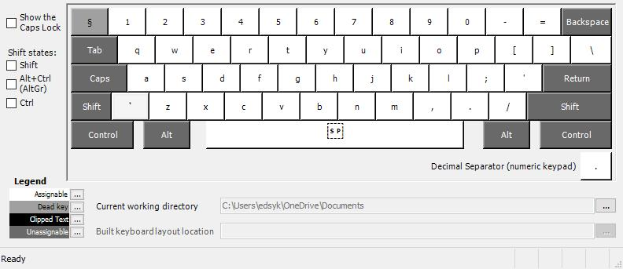
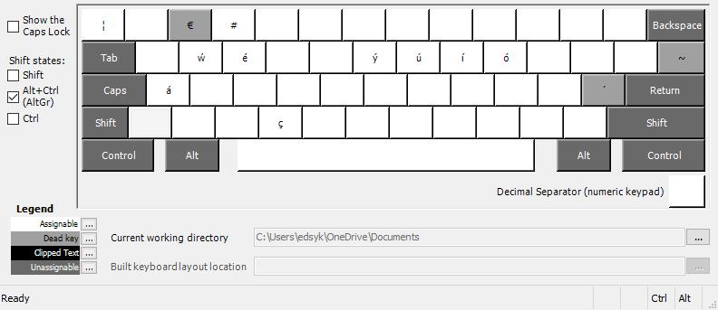

# MacbookProLate2013WindowsKeyboard
This is a custom keyboard created for a late 2013 macbook pro. I created it having found that windows 10 running on virtual box on El Capitan doens't map the keys correctly. 

This remamps all of the keys so that you should get a full mac keyboard experience.

If any keys are missing, let me know and I'll add them. 

## Key mapping layout
### without shift

### with shift

### with ctrl-shift (right alt, alt grave)
 
